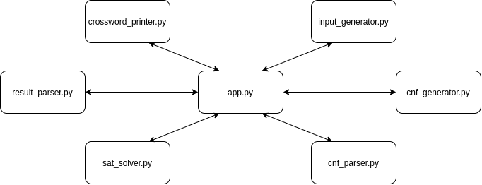

# crossword-generator

Generator of random crosswords using a SAT solver

## Problem

This script generates a random crossword using a given set of words. The main strategy for solving the problem is using a SAT Solver and Python 3 is the language used to generate the input for the SAT Solver, read the output and print the crossword.

## SAT Solver

### What is a SAT Solver
The Boolean SATisfiability Problem is the problem of finding a solution of a boolean forumla (specifically a CNF). This is an NP-complete problem, but some algorithms exist that can sometimes solve this problem in a resonable time using different kinds of heuristics.

### What is a CNF
A CNF (Conjunctive Normal Form) is a conjunction of disjunctions of boolean variables. Some examples of CNFs that use the variables A, B, C and D are:
- (A ∨ B) ∧ (A ∨ ¬B)
- A ∧ ¬A
- (A ∨ B ∨ ¬C) ∧ (B ¬C ¬D) ∧ D ∧ (D ∨ ¬A)

The values of the variables that satisfy the equation are the solution of the equation. Each equation can have many solutions (satisfiable), or it may not have any (unsatisfiable). If the equation is satisfiable, the SAT Solver will eventualy find only one of the solutions.

### The SAT Solver used in the project
The SAT Solver used in the project is [MiniSat](http://minisat.se/). This is a free SAT Solver that the script runs on the Unix shell. It can however be easily changed if needed.


## Structure

This is the structure of the project:



`app.py` manages the interaction between the different parts of the project. The following image shows the details about how the parts interact:


#### `input_generator.py`
This script generates the input as a dictionary. This dictionary contains some information such as:
- height and width of the table
- the list of words, divided into groups
- a list of cells that must be black in the table

This script is crucial because it contains the constraints that can make the crossword better or worse, but that are not necessary in a valid crossword. These constraints must be chosen carefully because, if there are too many, the SAT solver will not be able to find a solution in a resonable time. The choice of the constraints is discussed [below](#cnf-constraints).

#### `cnf_generator.py`
This script takes the input dictionary and returns the cnf written in an easily readable format. It enforces the constraints necessary for a valid crossword, but also the additional ones contained in the input dictionary. How the cnf describes the constraints of a crossword is described [below](#cnf-constraints).

#### `cnf_parser.py`
This script translates the cnf in the DIMACS CNF format. The main difference between this and the format used before is that in this one the variables' names are consecutive numbers, while in the output produced by cnf_generator.py the variables' names are string. This passage is useful because having a readable CNF makes debugging much easier.

#### `sat_solver.py`
This script runs the SAT Solver, either with a time limit or with no time limit. It is made in such a way that if the SAT Solver changes, this is the only file that has to be changed (unless the new SAT Solver does not use the DIMACS CNF format).

#### `result_parser.py`
This script converts the output in the DIMACS CNF format into a dictionary containing the words, their startin position and their direction (down or across).

#### `crossword_printer.py`
This script prints the crossword in the terminal or as a pdf (*not yet implemented*)

#### `var_to_string.py`
This script is used by other scripts to get the strings that represent variables by calling some functions instead of having to deal with strings directly. Because of its secondary role in the project, it is not included in the diagrams.

#### `app.py`
This is the main script of the project because it calls all the other functions in the project. In addition to that, it can use many different strategies, which are described below.

## CNF constraints

### Input data

Some of the constranints imposed in the CNF can vary in different ways. The choices are generated in the `input_generator` script, and passed to `cnf_generator` using the `input` dictionary. This contains the following fields:

#### `width`
The width of the crossword. Together with height, these are the only parameters chosen in `app.py` because of their importance in how long the SAT Solver will take to find a solution to the CNF.

#### `height`
The height of the crossword. Together with width, these are the only parameters chosen in `app.py` because of their importance in how long the SAT Solver will take to find a solution to the CNF.

#### `black_cells`
Some random cells are initially chosen to be black, and are stored as pairs in this list. This ensures that non-trivial solutions are found, and that different solutions are generated when running the script on the same set of words multiple times. This is especially useful when the other constraints are less strict. If there are many strict constraints, it is a good choice to have no cell in the list.

#### `words`
The words in the crossword are chosen from a dictionary. It is good to have a big dictionary and choosing words randomly to get different results when running the script multiple times.

`words` is a list of lists. Words are grouped in sublists because the SAT Solver doesn't have to use all the words, but just one for each group. There is an important tradeoff in this choice:

- There are many possible choices of words. For example in a 10 words crossword, with 20 words in the list divided into groups of 2, there are 2^10 possible combinations of words.
- This additional constraint adds a lot of complexity to the CNF, slowing it down significantly.

However, the generator can divide words into groups of size 1, so that there is no difference with a simple list of words where all words must be used.

### Variables

These are the variables used in the CNF.

#### `c_i,j,s`
c_i,j,s is true if cell (i,j) contains symbol s. s could be an alphabet letter or '/' if the cell is black.

#### `h_i,j,w`
h_i,j,w is true if word w is horizontal and starts from cell (i,j). (w in an index). 

#### `v_i,j,w`
v_i,j,w is true if word w is vertical and starts from cell (i,j). (w in an index).

#### `H_i,j`
H_i,j is true if any word is horizontal and starts from cell (i,j). H_i,j = ∪ h_i,j,w

#### `V_i,j`
V_i,j is true if any word is vertical and starts from cell (i,j). V_i,j = ∪ v_i,j,w

### Logic identities

This is a list of some of the logic identities used when deriving constraints.

#### Implication as disjunction
A ⇒ B ≡ ¬A ∨ B

#### De Morgan's Laws
¬(A ∧ B) ≡ ¬A ∨ ¬B

¬(A ∨ B) ≡ ¬A ∧ ¬B

### Necessary constraints

The following constraints are necessary for the CNF to produce a valid crossword.


#### If and only if condition for H
This is the definition of H_i,j:

H_i,j ⇔ ∪ h_i,j,w

It can be transformed in the following CNF:

(¬H_i,j ∨ ∪ h_i,j,w) ∧ ∩ (¬h_i,j,w ∨ H_i,j)

This how the CNF can be derived:

H_i,j ⇔ ∪ h_i,j,w

(¬H_i,j ⇒ ∪ h_i,j,w) ∧ (∪ h_i,j,w ⇒ H_i,j)

(¬H_i,j ⇒ ∪ h_i,j,w) ∧ ∩ (h_i,j,w ⇒ H_i,j)

(¬H_i,j ∨ ∪ h_i,j,w) ∧ ∩ (¬h_i,j,w ∨ H_i,j)

#### If and only if condition for V
This is the definition of V_i,j:

V_i,j ⇔ ∪ v_i,j,w

It can be transformed in the following CNF:

(¬V_i,j ∨ ∪ v_i,j,w) ∧ ∩ (¬v_i,j,w ∨ V_i,j)

The CNF can be derived in the same way as with H.

#### At least one symbol in each cell

Each cell must contain at least one symbol. For each cell (i,j), the CNF clause is:

∪ c_i,j,s

#### At most one symbol in each cell

Each cell can contain at most one symbol. This constraint, combined with the previous one, ensures that each cell contains exactly one symbol. For each cell (i,j), the CNF clause is (where a and b are different symbols):

¬c_i,j,a ∧ ¬c_i,j,b

This clause is derived from:

c_i,j,a ⇒ ¬c_i,j,b 

which imposes that, if a is in cell (i,j), then b can't be there.

#### One word for each group must be in the table

For each group of words (defined [here](#words)), one word must be in the crossword. Imposing this condition is quite expensive because there is no variable indicating if a word is used or not. Only a single long clause is needed for each group:

∪ h_i,j,w ∨ v_i,j,w

#### Each word at most once in the table

Each word can be at most once in the table. This is one of the most expensive conditions in the CNF, because it takes many clauses, in the order of O((height * width)^2). For each word w and for each pair of cells (i1,j1) and (i2,j2), the following implications must hold.

(h_i1,j1,w ⇒ ¬v_i1,j1,w) ∧
(v_i1,j1,w ⇒ ¬h_i1,j1,w)

(h_i1,j1,w ⇒ ¬h_i2,j2,w ∧ ¬v_i2,j2,w) ∧
(v_i1,j1,w ⇒ ¬h_i2,j2,w ∧ ¬v_i2,j2,w)

What they mean is that, if a word is in (i1,j1) in a certain direction, it can't be in the same place in the other direction, or anywhere else in the table. They can be transformed in a CNF in the following way:

(h_i1,j1,w ⇒ ¬v_i2,j2,w) ∧ (h_i1,j1,w ⇒ ¬h_i2,j2,w) ∧ (v_i1,j1,w ⇒ ¬v_i2,j2,w)

(¬h_i1,j1,w ∨ ¬v_i2,j2,w) ∧ (¬h_i1,j1,w ∨ ¬h_i2,j2,w) ∧ (¬v_i1,j1,w ∨ ¬v_i2,j2,w)

#### For each word the correct symbols are in the table

If a words starts in a given cell in a certain direction, then all of the following cells should contain the correct symbol. This also means that the cells before and after the word contain /, or are outside the grid. Let c0,c1,c2...cn be the characters of the word. Then, for each cell (i,j) and for each word w:

(h_i,j,w ⇒ c_i-1,j,/) ∧ (h_i,j,w ⇒ c_i+n,j,/) ∧ ∩ (h_i,j,w ⇒ c_i+k,j,ck) 

(v_i,j,w ⇒ c_i,j-1,/) ∧ (v_i,j,w ⇒ c_i,j+n,/) ∧ ∩ (v_i,j,w ⇒ c_i,j+k,ck) 

Expressed as a CNF, it becomes:

(¬h_i,j,w ∨ c_i-1,j,/) ∧ (¬h_i,j,w ∨ c_i+n,j,/) ∧ ∩ (¬h_i,j,w ∨ c_i+k,j,ck) 

(¬v_i,j,w ∨ c_i,j-1,/) ∧ (¬v_i,j,w ∨ c_i,j+n,/) ∧ ∩ (¬v_i,j,w ∨ c_i,j+k,ck) 

#### No word can go out of the grid
To make sure that no word can extend over the limit of the grid, the starting points that are too close to the borders should be false. Therefore, for each word w of length n:

For i from width - n + 1 to width - 1:

¬h_i,j,w

For j from height - n + 1 to height - 1:

¬v_i,j,w

#### 2 or more consecutive letters are part of a word

If this constraint is needed for the crossword depends how a crossword is defined. Ensuring that 2 or more consecutive letters are part of a word extremely reduces the number of solutions, but gives much more realistic results, and is included for this reason.

A simple way to translate this condition is that, if a cell is black, then it must be followed (in both directions) by a word, a black cell or a letter and then a black cell (if it is not too close to the border). This translates into the following clauses, that hold for each cell (i,j):

c_i-1,j,/ ⇒ H_i,j ∨ c_i,j,/ ∨ c_i+1,j,/

c_i,j-1,/ ⇒ V_i,j ∨ c_i,j,/ ∨ c_i,j+1,/

The implications in the CNF become (where variables c_-1,j,/ and c_i,-1,/ are removed if present):

c_i-1,j,/ ∨ H_i,j ∨ c_i,j,/ ∨ c_i+1,j,/

c_i,j-1,/ ∨ V_i,j ∨ c_i,j,/ ∨ c_i,j+1,/

### Optional constraints

The following constraints are **not** necessary for the CNF to produce a valid crossword. They are however used to improve the quality of the crossword, especially avoiding trivial solutions.

#### Random black cells
The cells in `black_cells` must have the symbol '/'. Therefore for each of these cells (i,j), the following clause is in the CNF: 

c_i,j,/

## Strategies

#### Running the SAT Solver once
This is the simplest approach to the problem, since it runs the SAT Solver and keeps waiting for the results.

#### Running the SAT Solver many times
This is still a quite simple approach, but can give some improvements if a a lot of computation time is available. This function runs the SAT Solver, but stops it after a given time. If the SAT Solver is stopped, it starts again with a different (random) output. It is only effective on inputs that are not too easy but not too hard to solve.

#### Learn from previous random tests
By giving a score to some easier tests, it is possible to understand which words are easier to use in the SAT Solver, and this information can be used to find the final result.

#### Get the maximum/minimum of a condition
This approach is useful because normally, using CNFs, it is impossible to set the value of something to be as big as possible or as low as possible. In order to do that, a linear search or binary search can be used. A good example of this is trying to minimize the size of the table. The function would start by fixing the size to a given value, and, if the CNF is satisfiable with the value, the value is reduced by one and the algorithm starts again. It will eventually stop when the value of the size is so small that the CNF is unsatisfiable or that the SAT Solver takes more time than the given time limit. The same result can be obtained using binary search, but in this task the time gain would not be relevant compared to the time used by the SAT Solver.

## Results

#### Metrics

Some really simple metrics used to evaluate a crossword are:

- number of letters to number of cells ratio (letters/cells) (if a cell contains a letter used by two words, it is counted twice)

#### Initial

This is one of the best results obtained using the script so far.

```
b l o w / s h a k e
r / n / / / / / / n
i / / c / / a s / t
n / j o y / / i / i
g o / t / m / m / r
/ / / t i e / i c e
/ p / o / n / l / /
p a i n t / l a n d
/ i / / / / / r / /
/ d / m a r k / o f

ACROSS
(0, 0): bring
(0, 2): on
(0, 9): entire
(2, 3): cotton
(2, 7): similar
(4, 5): men
(6, 1): paid

DOWN
(0, 0): blow
(0, 5): shake
(2, 6): as
(3, 2): joy
(4, 0): go
(5, 3): tie
(5, 7): ice
(7, 0): paint
(7, 6): land
(9, 3): mark
(9, 8): of

letters/cells = 70/100 = 0.35
```

## Author

* **Federico Stazi** - [FedericoStazi](https://github.com/FedericoStazi)
