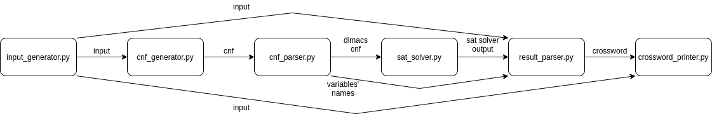

# crossword-generator

Generator of random crosswords using a SAT solver

## Problem

This script generates a random crossword using a given set of words. The main strategy for solving the problem is using a SAT Solver and Python 3 is the language used to generate the input for the SAT Solver, read the output and print the crossword.

## SAT Solver

### What is a SAT Solver
The Boolean SATisfiability Problem is the problem of finding a solution of a boolean forumla (specifically a CNF). This is an NP-complete problem, but some algorithms exist that can sometimes solve this problem in a resonable time using different kinds of heuristics.

### What is a CNF
A CNF (Conjunctive Normal Form) is a conjunction of disjunctions of boolean variables. Some examples of CNFs that use the variables A, B, C and D are:
- (A ∨ B) ∧ (A ∨ ¬B)
- A ∧ ¬A
- (A ∨ B ∨ ¬C) ∧ (B ¬C ¬D) ∧ D ∧ (D ∨ ¬A)

The values of the variables that satisfy the equation are the solution of the equation. Each equation can have many solutions (satisfiable), or it may not have any (unsatisfiable). If the equation is satisfiable, the SAT Solver will eventualy find only one of the solutions.

### The SAT Solver used in the project
The SAT Solver used in the project is [MiniSat](http://minisat.se/). This is a free SAT Solver that the script runs on the Unix shell. It can however be easily changed if needed.

## Structure

This is the structure of the project:

app.py manages the interaction between the different parts of the project. The following image shows the details about how the parts interact:

### input_generator.py
This script generates the input as a dictionary. This dictionary contains some information such as:
- height and width of the table
- the list of words
- a list of cells that must be black in the table

This script is crucial because it contains the constraints that make the crossword better, but that are not necessary in a valid crossword. These constraints must be chosen carefully because, if there are too many, the SAT solver will not be able to find a solution in a resonable time. The choice of the constraints is discussed below.

### cnf_generator.py
This script takes the input dictionary and returns the cnf written in an easily readable format. It enforces the constraints necessary for a valid crossword, but also the additional ones contained in the input dictionary. How the cnf describes the constraints of a crossword is described below.

### cnf_parser.py
This script translates the cnf in the DIMACS CNF format. The main difference between this and the format used before is that in this one the variables' names are consecutive numbers, while in the output produced by cnf_generator.py the variables' names are string. This passage is useful because having a readable CNF makes debugging much easier.

### sat_solver.py
This script runs the SAT Solver, either with a time limit or with no time limit. It is made in such a way that if the SAT Solver changes, this is the only file that has to be changed (unless the new SAT Solver does not use the DIMACS CNF format).

### result_parser.py
This script converts the output in the DIMACS CNF format into a dictionary containing the words, their startin position and their direction (down or across).

### crossword_printer.py
This script prints the crossword in the terminal or as a pdf (*TODO*)

### var_to_string.py
This script is used by other scripts to get the strings that represent variables by calling some functions instead of having to deal with strings directly. Because of its secondary role in the project, it is not included in the diagrams.

### app.py
This is the main script of the project because it calls all the other functions in the project. In addition to that, it can use many different strategies, which are described below.

## CNF constraints

## Strategies

#### Running the SAT Solver once
This is the simplest approach to the problem, since it runs the SAT Solver and keeps waiting for the results.

#### Running the SAT Solver many times
This is still a quite simple approach, but can give some improvements if a a lot of computation time is available. This function runs the SAT Solver, but stops it after a given time. If the SAT Solver is stopped, it starts again with a different (random) output. It is only effective on inputs that are not too easy but not too hard to solve.

#### Learn from previous random tests
By giving a score to some easier tests, it is possible to understand which words are easier to use in the SAT Solver, and this information can be used to find the final result.

#### Get the maximum/minimum of a condition
This approach is udeful because normally, using CNFs, it is impossible to set the value of something to be as big as possible or as low as possible. In order to do that, a linear search or binary search can be used. A good example of this is trying to minimize the size of the table. The function would start by fixing the size to a given value, and, if the CNF is satisfiable with the value, the value is reduced by one and the algorithm starts again. It will eventually stop when the value of the size is so small that the CNF is unsatisfiable or the SAT Solver takes more time than the given limit. The same result can be obtained using binary search, but in such a small table the time gain would not be relevant compared to the time used by the SAT Solver.
